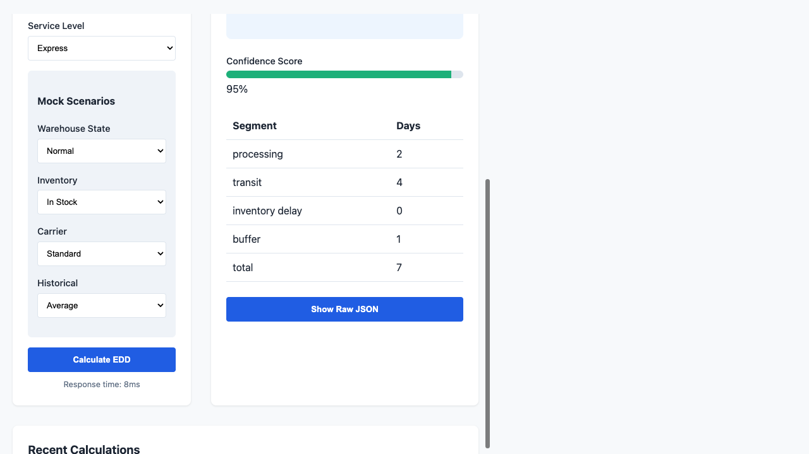

# EDD Engine Mock Playground

A lightweight, standalone development tool for interacting with the Estimated Delivery Date (EDD) engine using mock data.

## Features
- **Scenario Presets**: Instantly test Happy Path, Busy Warehouse, Low Stock, etc.
- **Mock Mode**: Fully functional backend mock API.
- **Dynamic Input**: Configure warehouse, service level, and custom mock scenarios.
- **Visualization**: Detailed breakdown Table, confidence scoring, and warnings.
- **History**: Calculation log persisted in local storage.

## Preview

## Setup & Run
1. Install dependencies: `npm install`
2. Start the mock server: `PORT=8081 MOCK_MODE=true node src/server.js`
3. Open playground: [http://localhost:8081/playground/index.html](http://localhost:8081/playground/index.html)
