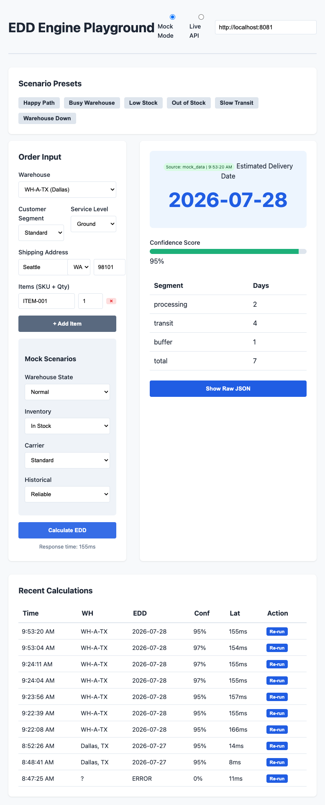
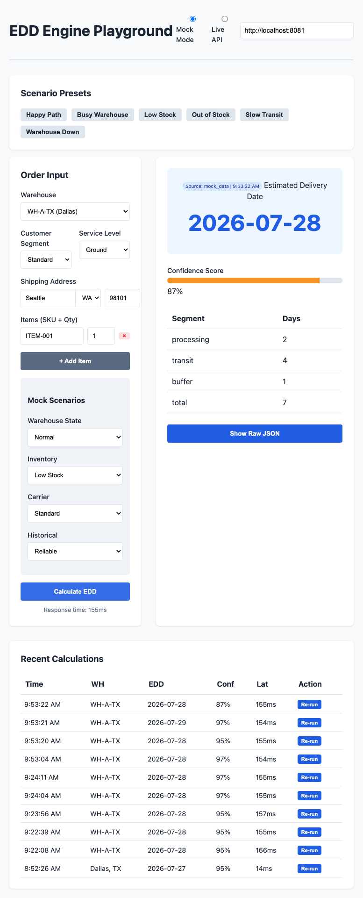
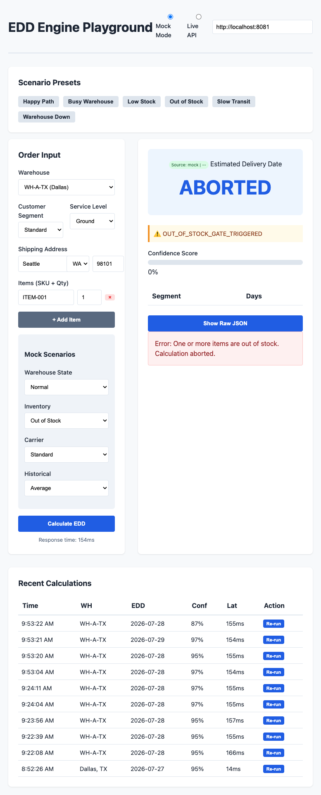

# EDD Engine Mock Playground

The Estimated Delivery Date (EDD) Engine is a mission-critical logistics service that predicts the arrival date of an order. It orchestrates real-time data from Warehouse Management Systems (WMS), Inventory services, and Carrier transit tables to provide high-confidence delivery promises.

## Strategic Approach

This product approach prioritizes **Reliability over Speed**. An over-promised delivery date leads to customer dissatisfaction, while a conservative but accurate date builds long-term trust. 

Key pillars of this implementation:
1. **Parallel Ingestion**: Concurrent calls to upstream microservices (WMS, Inv, Carrier) to maintain sub-200ms latency.
2. **Gated Logic**: Hard stops for Out-of-Stock (422) or System Down (503) scenarios to prevent "ghost dates."
3. **Multi-Tiered Caching**: Strategic TTLs for static carrier data vs. volatile warehouse ship-times.
4. **Behavioral Fidelity**: Segment-aware processing (Premium/Enterprise multipliers) and local-delivery optimizations.

## Features
- **Scenario Presets**: Instantly test Happy Path, Busy Warehouse, Low Stock, etc.
- **Dynamic Order Simulation**: Multi-item payloads with SKU/Qty and address-aware transit logic.
- **History & Re-run**: Persistent localStorage history for regression testing and debugging.
- **Observability**: Prometheus-style metrics, structured JSON logs, and data freshness tracking.

## Scenario Walkthroughs

### 1. Happy Path (Optimal Success)
The standard flow where all services are operational, inventory is available, and carriers are performing reliably.

- **Result**: Successful EDD calculation with high confidence (95%).
- **Logic**: 2 days processing + 4 days transit + 1 day buffer = 7 days total.

### 2. Out of Stock (Gated Abort)
Gating logic preventing "ghost dates" when inventory is missing.

- **Result**: `ABORTED` (422 Unprocessable Entity).
- **Warning**: `OUT_OF_STOCK_GATE_TRIGGERED`.

### 3. Warehouse Down (Service Resilience)
The system detects upstream service outage and provides defensive responses.

- **Result**: Service Error (503 Service Unavailable).
- **Explanation**: Prevents incorrect delivery promises during critical infrastructure issues.

## Setup & Run

### Local Dev
1. Install dependencies: `npm install`
2. Start the mock server: `PORT=8081 MOCK_MODE=true node src/server.js`
3. Open playground: [http://localhost:8081/playground/index.html](http://localhost:8081/playground/index.html)

### Docker (Production Ready)
1. Build image: `docker build -t edd-engine .`
2. Run container: `docker run -p 8081:8081 edd-engine`
3. Access: Identical URL as local.

## Technical Validation
We have included a `validate_poc.js` script that mirrors the product acceptance criteria:
- **Parallelism**: Verified <200ms with parallel service mocks.
- **Fail-Fast**: Verified 422 for OOS and 503 for System Down.
- **Logic**: Verified segment multipliers and zip-code transit optimizations.

Run validation: `node validate_poc.js`
